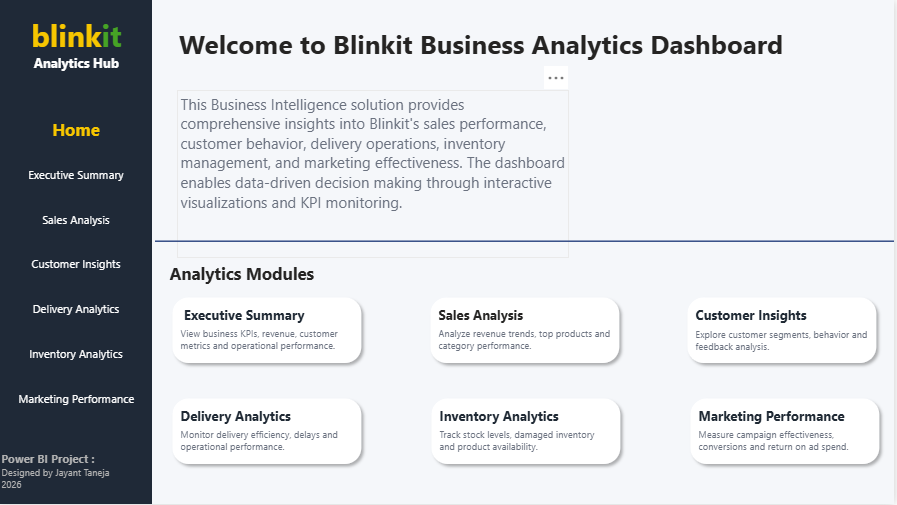
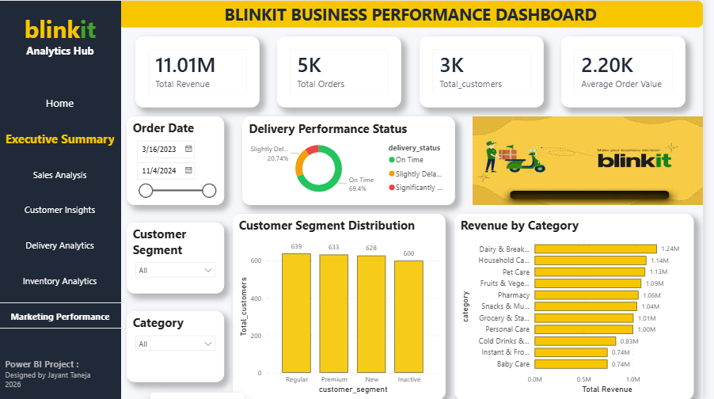
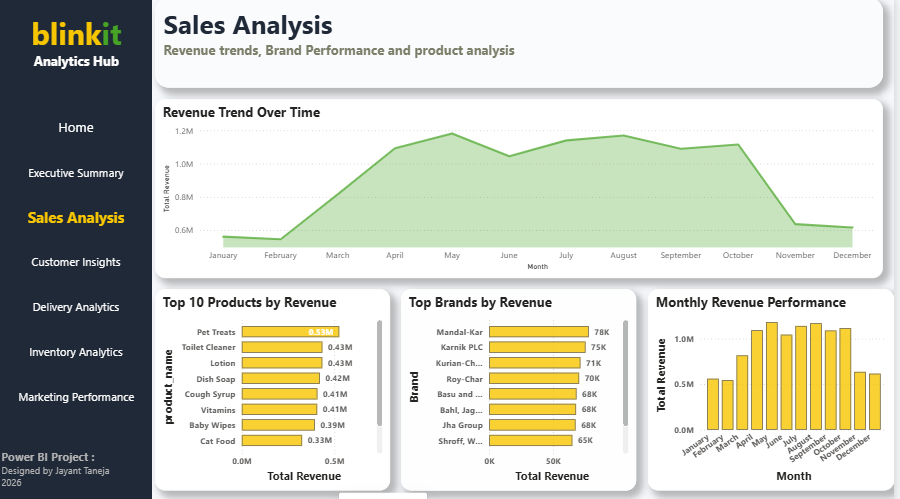
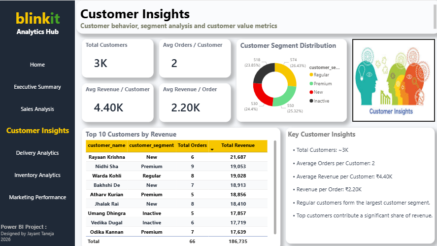
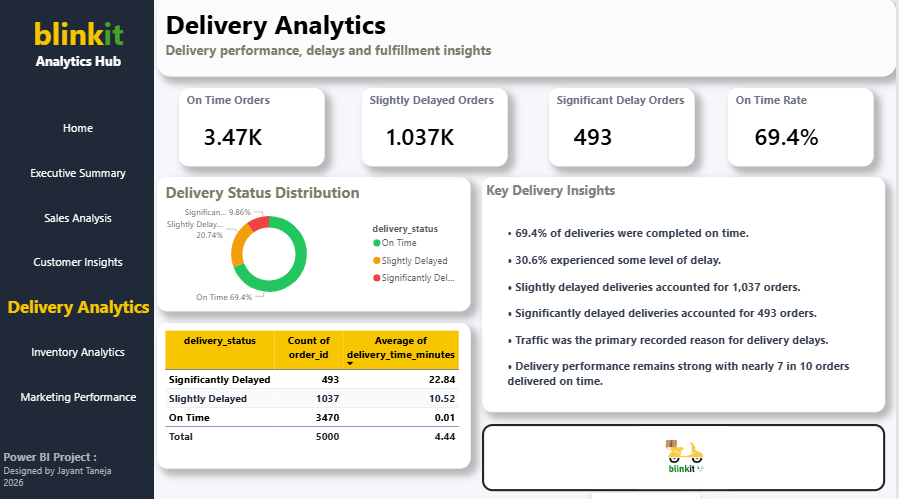
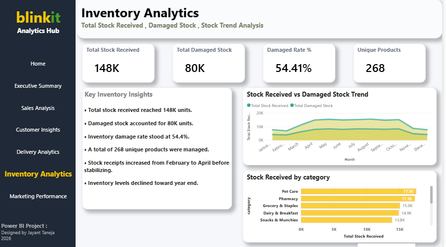
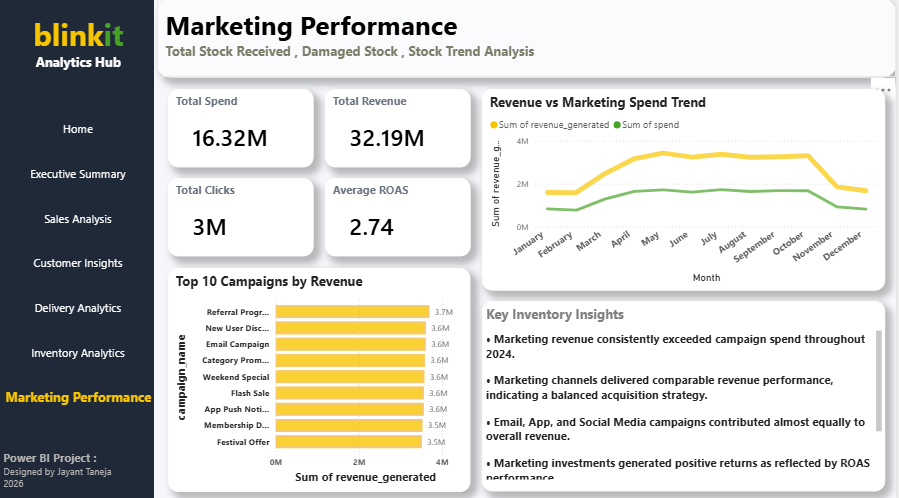

# Blinkit-PowerBI-Dashboard
# Blinkit Business Intelligence Dashboard

Power BI | DAX | Business Intelligence | Data Analytics

## Project Overview 

This Power BI dashboard provides a comprehensive analysis of Blinkit's business performance across Sales, Customers, Delivery, Inventory, and Marketing domains.

## Dashboard Pages

* Home
* Executive Summary
* Sales Analysis
* Customer Insights
* Delivery Analytics
* Inventory Analytics
* Marketing Performance

## Tools Used

* Power BI
* DAX
* Data Modeling
* Data Visualization

## Key Features

* Interactive Navigation
* KPI Monitoring
* Sales Trend Analysis
* Customer Segmentation
* Delivery Performance Tracking
* Inventory Monitoring
* Marketing Campaign Analysis

## Dashboard Preview

### Home

### Executive Summary

### Sales Analysis

### Customer Insights

### Delivery Analytics

### Inventory Analytics

### Marketing Performance

## Key Findings

- May recorded the highest revenue performance.
- On-time delivery rate was 69.4%.
- Average delivery delay was 4.44 minutes.
- Marketing revenue consistently exceeded marketing spend.
- Inventory trends remained stable for most of the year before declining toward year-end.
- A total of 268 unique products were monitored across inventory operations.
## Business Recommendations
### Sales Recommendations

* Replicate promotional campaigns and sales strategies used during May, the highest revenue-generating month, to improve performance during lower-revenue periods.
* Increase visibility and marketing support for top-performing product categories to maximize revenue contribution.
* Monitor low-performing products and consider pricing, bundling, or promotional adjustments to improve sales.

### Customer Recommendations

* Develop targeted loyalty programs for high-value customer segments to increase retention and repeat purchases.
* Use customer segmentation insights to create personalized marketing campaigns.
* Track customer lifetime value and focus acquisition efforts on the most profitable customer groups.

### Delivery Recommendations

* Improve route planning and operational efficiency to increase the on-time delivery rate beyond 69.4%.
* Investigate traffic-related delays and introduce proactive monitoring for high-risk delivery zones.
* Establish delivery performance benchmarks for delivery partners and track them regularly.

### Inventory Recommendations

* Conduct a detailed review of damaged stock processes and implement stronger quality-control measures.
* Improve inventory forecasting using historical demand patterns to reduce wastage and stock imbalances.
* Monitor category-level inventory trends and maintain optimal stock levels for high-demand products.

### Marketing Recommendations

* Continue investing in marketing activities that consistently generate revenue above campaign spend.
* Analyze the best-performing campaigns and replicate their targeting, messaging, and channel strategies.
* Regularly evaluate ROAS and allocate budget toward the most effective marketing initiatives.

### Strategic Recommendation

* Integrate sales, inventory, delivery, and marketing KPIs into a unified performance review process to support faster and more data-driven business decisions.

## Note

The Power BI source file (.pbix) and dataset are not publicly shared. This repository is intended for portfolio and project showcase purposes.
